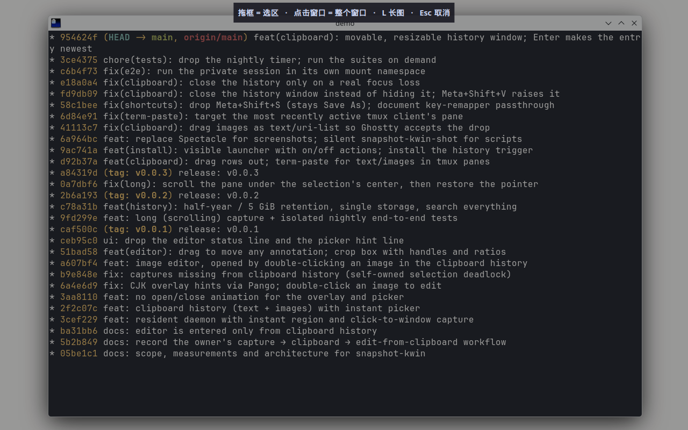
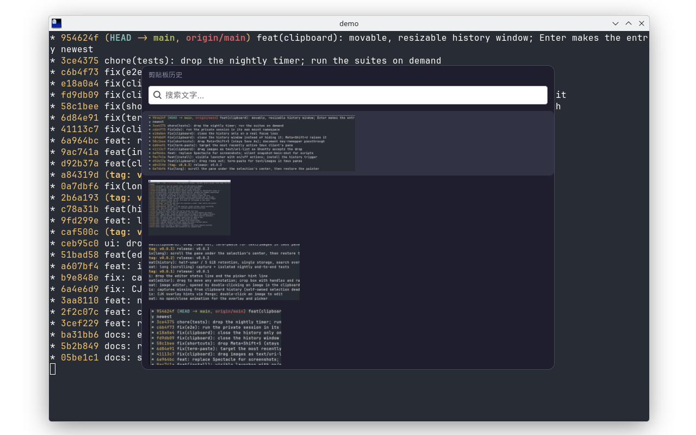
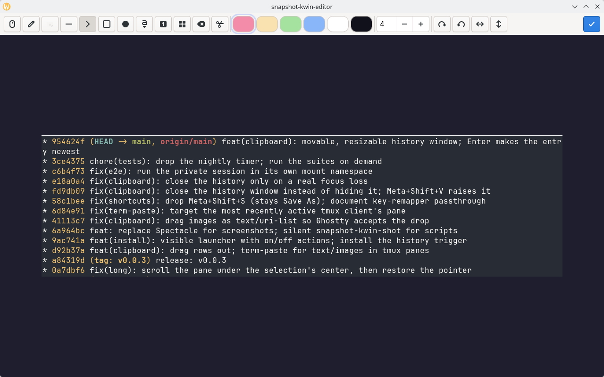

# snapshot-kwin

[](LICENSE) [](https://github.com/GeojoL/snapshot-kwin/releases)

**KDE Plasma 6（Wayland）秒开截图工具**：按下快捷键约 0.15 秒画面就冻结，拖框截选区、点窗口截整个窗口，图片直接进剪贴板。另带剪贴板历史（文字 + 图片）和标注编辑器。



> 这是一个常驻的**截图守护进程**，用来替代 Spectacle 的截图功能；Spectacle 仍保留录屏。截完不弹编辑器，要标注时从剪贴板历史里打开。
> 上图和下面两张图都是在隔离的嵌套 KWin（`kwin_wayland --virtual`，1280×800）里实际运行、用 KWin 截图接口截下的画面。

[安装](#安装) · [按键](#按键) · [常见问题](#常见问题) · [更新日志](CHANGELOG.md) · [English](#english)

## 为什么做这个

在 KDE Plasma Wayland 上，Spectacle 从按键到出现框选界面要 0.7–1.4 秒，截图节奏总被打断。实测发现慢在 Spectacle 自己的界面启动上，KWin 抓整屏只要 55–75 毫秒。

snapshot-kwin 让一个小的 GTK4 进程常驻，框选界面提前建好，按键时只抓一帧再显示出来，所以几乎是按下就出。截好的图直接进剪贴板，不弹窗；需要加箭头、打码时，再从剪贴板历史里双击打开编辑器。

## 安装

下面的步骤在作者的 Bazzite（Fedora 44 + KDE Plasma 6.7.5 Wayland）上实际执行过；其他发行版没有测试过（见[适用范围](#适用范围)）。

**第 1 步：确认依赖。** 需要 Plasma 6 Wayland 会话，以及 `python3` 的 GTK 4 绑定（`gi`）、`pycairo`、`dbus-python`、`wl-clipboard`（提供 `wl-paste`），还有 Plasma 自带的 `kpackagetool6`、`kwriteconfig6`。Bazzite 已自带全部依赖，不用另外安装。在 Fedora 上对应的包名是 `python3-gobject gtk4 python3-cairo python3-dbus wl-clipboard`（只在 Bazzite 上核对过这几个包已经装好，在普通 Fedora 上按这个包名安装未测试）。

**第 2 步：下载到一个长期存放的目录，然后运行安装脚本**（不需要 sudo）

```bash
git clone https://github.com/GeojoL/snapshot-kwin.git
cd snapshot-kwin
./install.sh
```

守护进程直接从这个目录运行，装好后不要移动或删除它。更新时 `git pull` 后再运行一次 `./install.sh`。

**第 3 步（可选）：Enter 自动粘贴。** 在剪贴板历史里按 Enter 后，程序会用 `ydotool` 发一次粘贴键。这需要 `ydotoold` 正在运行（本项目不负责安装它）。作者的环境里 `ydotoold` 是用户服务；没有 `ydotoold` 时的行为未测试。

卸载：`./install.sh --uninstall`。剪贴板历史会保留在 `~/.local/state/snapshot-kwin/`，不想要可以手动删除。卸载**不会**把截图快捷键还给 Spectacle，需要的话在「系统设置 → 快捷键」里重新设置。

安装脚本做的事（都在用户目录里，不改系统文件）：

- 复制一份 Python 解释器到 `~/.local/libexec/snapshot-kwin/`，只授权这一份调用 KWin 截图接口（原因见[原理](#原理给开发者)）；
- 在 `~/.local/share/applications/` 写入几个 `.desktop` 文件（一个能在应用菜单里搜「截图」找到）；
- 安装一个 KWin 脚本和一个 KWin 效果，并在 `~/.config/kwinrc` 里启用；
- 写入用户服务 `~/.config/systemd/user/snapshot-kwin.service` 并启动；
- 在 `~/.local/bin/` 放 `snapshot-kwin-capture`、`snapshot-kwin-history`、`snapshot-kwin-shot`、`term-paste`；
- 设置全局快捷键，并清掉 Spectacle 的所有**截图**快捷键（录屏快捷键不动）。

## 按键

全局快捷键：

| 按键 | 作用 |
|---|---|
| Meta+Alt+1、Print、Meta+Shift+Print | 截图 |
| Meta+Shift+V | 打开剪贴板历史（已经打开时把它提到最前） |

截图时（画面冻结后）：

| 操作 | 作用 |
|---|---|
| 拖框 | 截选区，进剪贴板 |
| 单击窗口 | 截整个窗口 |
| L | 切换到长图：选好区域或窗口后自动滚动并拼接；再按一次截图键停止 |
| Esc | 取消 |

剪贴板历史：



| 操作 | 作用 |
|---|---|
| ↑ ↓ | 选择 |
| Enter | 选中的这条成为当前剪贴板内容并排到第一条，然后粘贴到之前的窗口；之后再按粘贴键还是它 |
| Shift+Enter，或双击图片 | 用编辑器打开图片 |
| 直接打字 | 搜索文字记录 |
| 把一行拖出去 | 图片以 PNG 文件拖出（终端里得到路径，浏览器、聊天软件里是附件），文字以文字拖出 |
| 拖顶部「剪贴板历史」那一条 | 移动窗口 |
| 拖窗口的边或角 | 调整大小；位置和大小下次打开时恢复 |
| Esc，或点别的窗口 | 关闭 |

编辑器：



工具快捷键：V 选择/移动，P 画笔，H 荧光笔，L 直线，A 箭头，R 矩形，E 椭圆，T 文字，N 编号，M 马赛克，X 橡皮，C 裁剪。Ctrl+Z 撤销、Ctrl+Shift+Z 重做，Delete 删除选中的标注，Enter 完成（结果进剪贴板，同时成为历史第一条），Esc 关闭。

给脚本用：`snapshot-kwin-shot [输出.png]` 静默保存整个桌面并打印路径，不显示界面，也不动剪贴板。

## 适用范围

| 环境 | 状态 | 怎么测的 |
|---|---|---|
| Bazzite 44（Fedora 44）+ KDE Plasma 6.7.5 Wayland，单屏 2560×1440，100% 缩放 | ✅ | 作者日常使用；按本文第 2 步安装 |
| 嵌套的 `kwin_wayland --virtual`（KWin 6.7.5） | ✅ | `tests/e2e/run.sh` 的 15 项端到端测试全部通过：选区、点窗口、长图、编辑器、剪贴板历史的打开/关闭/确认/位置恢复、没有 Klipper 时记录别的程序复制的文字、监听进程被杀后自动恢复 |
| 多显示器、分数缩放 | 未测试 | |
| 其他发行版、Plasma 5、X11 会话、GNOME 等其他桌面 | 未测试 | 依赖 KWin 6 的 Wayland 截图接口，X11 和其他桌面基本不可能直接用 |

欢迎在 Issue 里反馈你的测试结果。

## 常见问题

**按快捷键没反应？**
先看服务是否在运行：`systemctl --user status snapshot-kwin`，日志用 `journalctl --user -u snapshot-kwin` 查看。也可以在应用菜单里搜「截图」，右键选「开启」。

**我用了 xremap 之类的按键映射工具，Meta+Alt+1 被吃掉了？**
映射工具如果忽略多余的修饰键，应用里的映射（比如 Chrome 的 Meta+1 → Ctrl+1）会先吞掉截图键。把截图快捷键放在映射规则的最前面直接放行即可。

**Enter 自动粘贴发的是什么键？**
默认发 Meta+V。作者用按键映射工具把 Meta+V 按应用翻译成各自的粘贴键（macOS 式习惯）。直接用 Ctrl+V 的话，可以通过服务的环境变量 `SNAPSHOT_KWIN_PASTE_KEYS` 改成 `29:1 47:1 47:0 29:0`（Ctrl+V 的 ydotool 键码）；这个改法未实测。

**终端里能粘贴图片吗？**
终端只能粘贴文字。安装脚本放了一个 `~/.local/bin/term-paste`，把终端的粘贴键绑定到它（需要 tmux）：剪贴板是文字就粘贴文字；是图片时，如果当前 tmux 窗格是 Claude Code 就发 Ctrl+V，否则把 PNG 存到 `~/.local/state/snapshot-kwin/paste/` 再粘贴路径。

**Plasma 的剪贴板小部件（Klipper）要开着吗？**
不需要。snapshot-kwin 自己监听剪贴板（需要 `wl-paste`，即 wl-clipboard）。在没有 Klipper 的嵌套 KWin 里由端到端测试验证过：别的程序复制的文字能被记录。

**历史会占多少空间？**
默认保留半年、图片最多 5 GiB，超出时先删最旧的。可以在 `~/.config/snapshot-kwin/config.json` 里修改：

```json
{"max_age_days": 183, "max_bytes": 5368709120}
```

## 已知限制

- 只测试过单显示器、100% 缩放。
- 卸载后 Spectacle 的截图快捷键不会自动恢复。
- 代码必须留在 clone 的目录里，移动目录后要重新运行 `./install.sh`。

## 原理（给开发者）

截图用的是 KWin 受限的 `org.kde.KWin.ScreenShot2` D-Bus 接口。KWin 按调用者可执行文件的真实路径，去匹配声明了 `X-KDE-DBUS-Restricted-Interfaces` 的 `.desktop` 文件，所以安装脚本只授权一份专用的解释器副本，系统里的其他 Python 脚本不会因此获得截屏权限。剪贴板变化由守护进程启动的 `wl-paste --watch` 监听（KWin 提供 ext-data-control 协议，不需要窗口焦点，也不依赖 Klipper），监听进程退出会自动重启。常驻的 KWin 脚本在窗口变化时把窗口位置推给守护进程，点选窗口无需再查询；剪贴板历史窗口的位置和大小也由它回报。一个只作用于本工具窗口的 KWin 效果去掉了打开/关闭动画。界面是 Python + GTK4 + cairo，全部使用发行版自带的包。

测试：`python3 -m unittest discover -s tests` 跑单元测试；`tests/e2e/run.sh` 在独立的 D-Bus 会话、独立挂载命名空间里启动不可见的嵌套 KWin 跑端到端测试，不碰你的桌面、焦点、输入和剪贴板。设计记录见 [docs/design-notes.zh.md](docs/design-notes.zh.md)。

## 许可证

MIT

## English

**snapshot-kwin** is an instant screenshot daemon for **KDE Plasma 6 on Wayland**.
Press the hotkey and the screen freezes in about 150 ms (Spectacle took 0.7–1.4 s
on the same machine): drag to capture a region or click a window, and the image
goes straight to the clipboard. A clipboard history (text and images; movable,
resizable window on Meta+Shift+V) and an annotation editor (arrows, shapes, text,
numbered stamps, mosaic, crop) come with it. Install per user with `./install.sh`
(no root). Tested on Bazzite 44 / Plasma 6.7.5 Wayland with a single 100%-scaled
monitor, and by an end-to-end suite in a nested headless KWin; other setups are
untested. MIT licensed.
